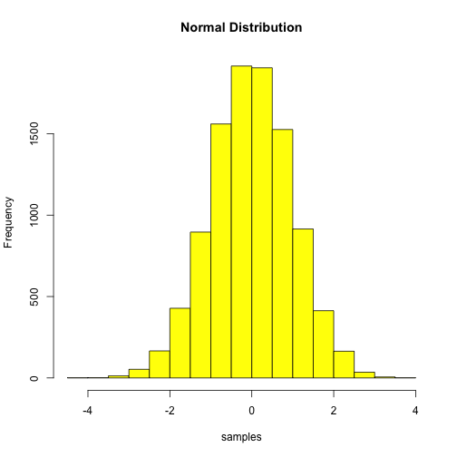

## Goals on the shiny project

The goals we want to achieve with the application are:

1. Learn and show how to use shiny to develop web applications based on R
2. Play with normal distribution as a way to teach my daugther how the normal distributions behaves
3. Use slidify to show how the application works
4. Use both this slidify presentation and the shiny application as the project for **Developing Data Products** project

--- .class #id 

## The shiny application

The application is built with shiny that allows to build a server in R (*server.R*) and the front end (web page) using R (*ui.R*).

The application allows the user to select:

* **Number** of random samples
* **Mean** of the normal distribution
* **Standard deviation** of the distribution
* How to render the plot, by using a **histogram** or a **density plot**.


On the main are on the right side, we have 2 tabs, one to render the plot and a second one to render a summary of the random samples.

--- 

## The shiny structure

The shiny project is built with 2 files:

### ui.R

The file were we define the user interface. 

It has two sections:

* Main area: with two tabs were the plots and summary is rendered
* Left panel: where input sliders for customizable controls (mean, samples and sd) are render for the user to configure


### server.R

The server file, gets the input values from the user interface and will render normal distribution (plot or summary), with the numebr of samples, mean and SD received from the UI.


---  

## Some code samples

Let's see now, some of the plots in action.
The code for generating the random values following a normal distribution and the summary of the samples would be:


```r
samples<-rnorm(10000,0,1)
summary (samples)
```

```
##      Min.   1st Qu.    Median      Mean   3rd Qu.      Max. 
## -4.214000 -0.679900 -0.009522 -0.011480  0.656600  3.544000
```


--- 

## More code samples
The  render of the histogram would be: (code not displayed - echo=FALSE -)
 

